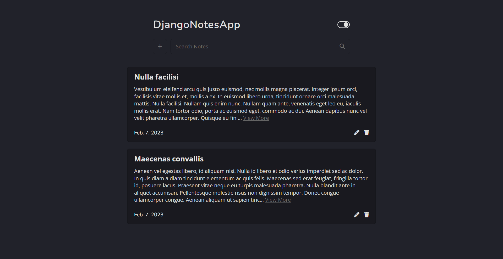
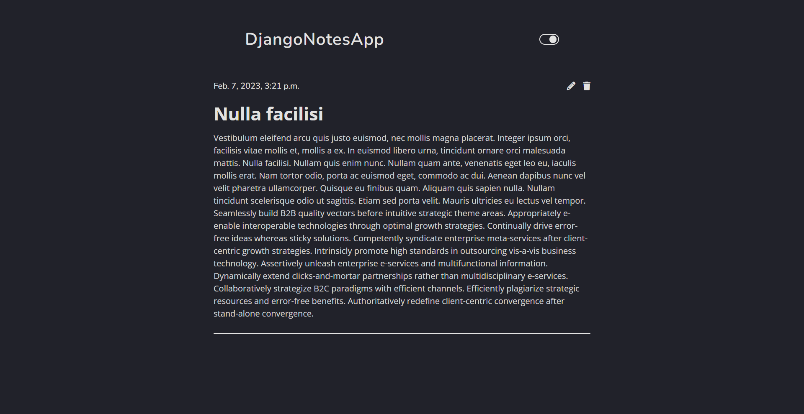

## Django Notes App

Simple notes app build with Django.

### Features

- CRUD Functionality
- light/dark theme toggle
- Responsive Design

### Links

[Source code](https://github.com/sam4web/django-notes-app) (Github)

### How to run it?

1. Clone this repo
   ```bash
   git clone <this-repo>
   ```
2. Setup & activate python env
   ```bash
   cd <this-repo>
   python -m venv env
   source env/Scripts/activate
   ```
3. Install required python modules
   ```bash
   pip install -r requirements.tx
   ```
4. Migrate django models
   ```bash
   python manage.py makemigrations base
   python manage.py migrate
   ```
5. Start django server

   ```bash
   python manage.py runserver
   ```

Open http://127.0.0.1:8000/ to view it in your browser.

### Preview Images



